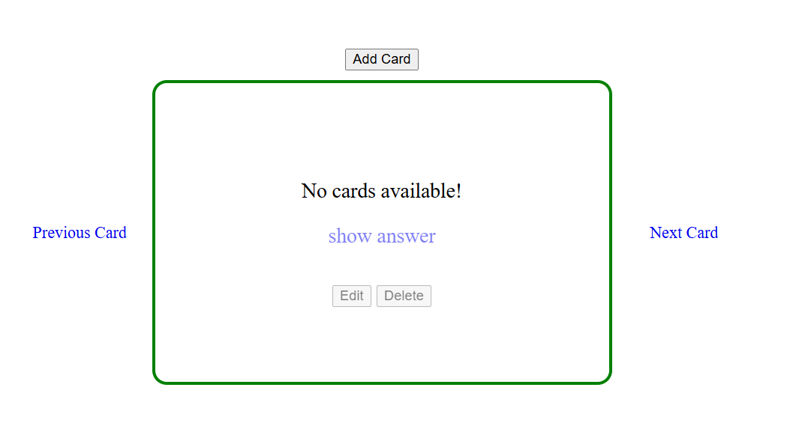
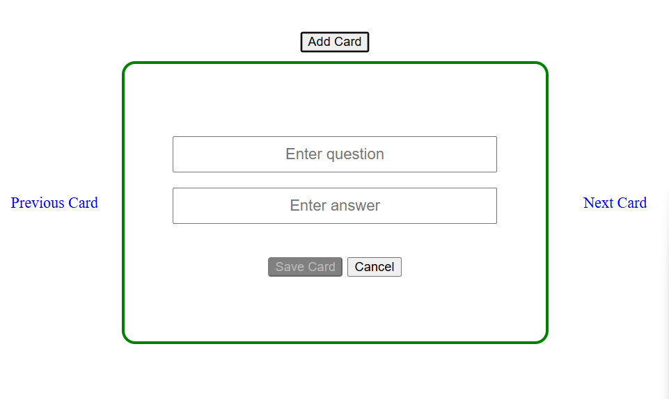
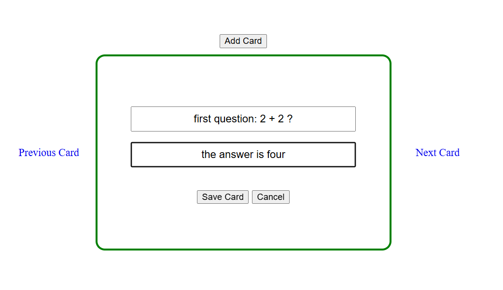
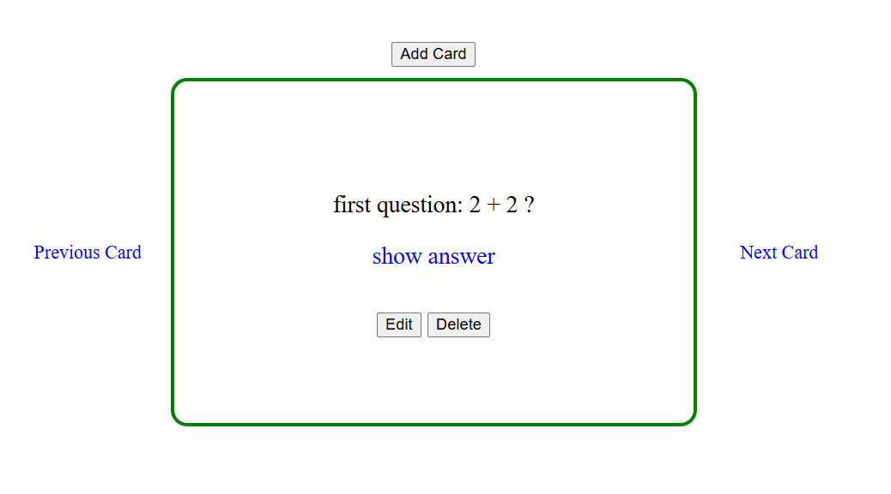
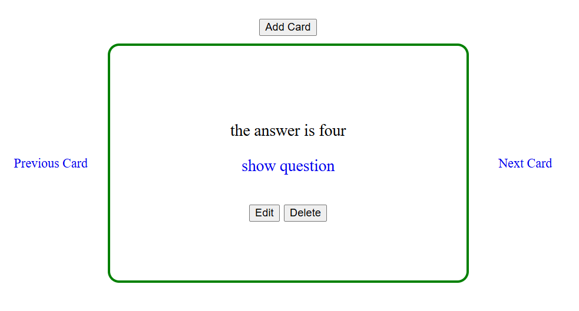

# Flash Cards (Vanilla JS)

A minimal flash-cards app built with **plain JavaScript, HTML, and CSS**.  
Create cards, toggle between **question/answer**, navigate **previous/next**, **edit** or **delete** cards, and keep everything **persisted in cookies** (via `js-cookie`).

---

## Features
- Add, edit, delete flash cards
- Toggle **question ↔ answer**
- Navigate **Previous / Next** (wrap-around)
- Disabled states when there are no cards
- Form validation: **Save** stays disabled until both fields are filled
- Data persistence with cookies (`js-cookie`)

---

## Getting Started
1. Clone or download the repository.
2. Open `ex05-JS.html` in a browser (or run with a local server like VS Code **Live Server**).
3. Click **Add Card** to create your first card.

> Tech stack: Vanilla JS + HTML + CSS, `js-cookie` via CDN.

---

## Screenshots

### 1) Answer view (with link to show the question)

**What you see**
- The current card shows the **answer**.
- Center link switches to **show question**.
- **Edit** and **Delete** actions are available.

---

### 2) Question view (with link to show the answer)

**What you see**
- The current card shows the **question**.
- Center link switches to **show answer**.

---

### 3) Edit mode (prefilled inputs)

**What you see**
- Existing question/answer are loaded into inputs.
- **Update** the card and save, or **Cancel**.

---

### 4) Add mode (empty form, Save disabled)

**What you see**
- Empty inputs for **question** and **answer**.
- **Save Card** is disabled until both fields are filled.

---

### 5) Empty state (no cards)

**What you see**
- Message: **No cards available!**
- Actions like **Edit/Delete** are disabled.

---

## Folder Structure
  ├── ex05-JS.html
  ├── ex05-JS.js
  ├── styles.css
  └── img/
    ├── 01.png
    ├── 02.png
    ├── 03.png
    ├── 04.png
    └── 05.png
